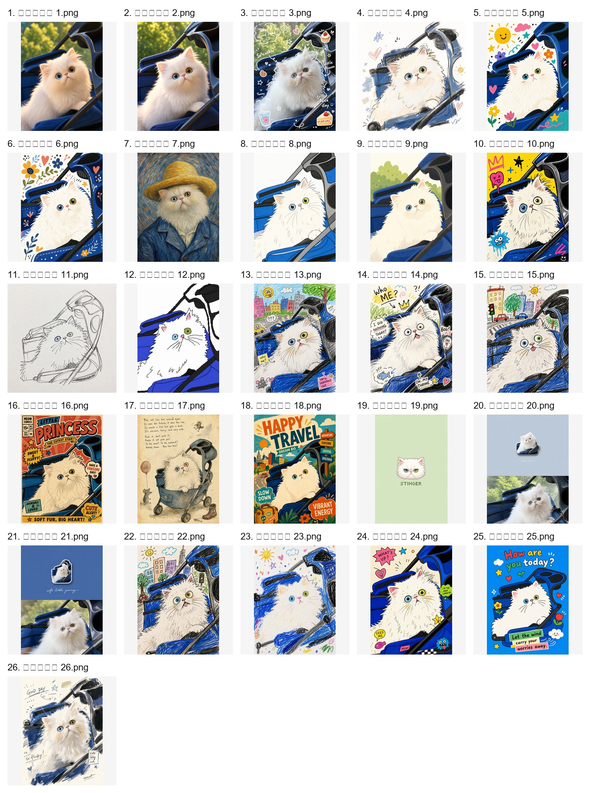

# 26 个宠物转绘提示词风格相似度对比

分析对象：`pet_pics/已生成图像 1.png` 到 `pet_pics/已生成图像 26.png`

总览图：  

## 结论摘要

这 26 张里确实有不少风格高度相似，尤其集中在三类：

1. **照片质感可爱 3D/拟真类**：1、2 几乎可以直接合并。
2. **白猫婴儿车手绘涂鸦类**：4、10、13、14、15、22、23、24、26 视觉语言重叠很高，只是涂鸦密度、背景和文字数量不同。
3. **平面儿童插画/装饰涂鸦类**：5、6、8、9、25 都是可爱平面化、粗线条、儿童插画气质，可以压缩成 1 到 2 个风格。

如果目标是减少重复、让用户感知差异更明显，建议从 26 个压缩到约 **12-15 个风格**。如果想保留更多细分，可以压缩到 **16-18 个风格**。

## 强烈建议合并

| 合并组 | 图片编号 | 建议统一风格名 | 相似点 | 建议保留方向 |
| --- | --- | --- | --- | --- |
| A | 1、2 | 可爱 3D 动画 / 毛绒拟真 | 都是同一构图下的柔光、毛绒、圆润 3D 可爱宠物效果，差异主要是眼神和细节微调 | 保留 1 个即可。优先保留毛发更自然、主体更稳定的一张作为预览 |
| B | 20、21 | 极简照片拼贴 / 冰箱贴旅行卡片 | 上半部分都是小型贴纸图标，下半部分保留原照片，版式几乎一致 | 保留 1 个。另一个提示词可作为同风格变体，不建议单独占一个风格入口 |
| C | 13、14、22、24 | 搞笑手绘涂鸦 / 网络梗图插画 | 都是白猫婴儿车、粗糙蜡笔/马克笔线条、夸张眼睛、文字标注、随手涂鸦背景 | 合并为 1 个主风格。可通过参数控制“文字多/少”“背景复杂/简单” |
| D | 5、6、25 | 装饰性儿童平面插画 | 高饱和蓝底、白猫平面化、花朵爱心星星装饰、可爱儿童绘本感非常接近 | 合并为 1 个。保留装饰元素最稳定、构图最完整的一版 |

## 可选合并

| 合并组 | 图片编号 | 建议统一风格名 | 判断 | 处理建议 |
| --- | --- | --- | --- | --- |
| E | 8、9、5、6、25 | 可爱平面卡通插画 | 8、9 比 5、6、25 更简洁，但同属平面化、粗线条、儿童卡通 | 如果要精简，合并成 1 个“可爱平面卡通”；如果要保留差异，拆成“简洁平面版”和“装饰涂鸦版” |
| F | 4、23、26 | 速写涂鸦 / 蜡笔草稿 | 都是白底或浅底、蓝色婴儿车、粗糙手绘笔触、留白较多 | 可以合并为 1 个“速写涂鸦”。26 的完成度更高，4 更像轻水彩，23 更像儿童蜡笔 |
| G | 10、13、14、15、22、24 | 搞笑丑萌涂鸦 | 都是夸张表情、凌乱线条、手写文字、卡通背景/贴纸装饰 | 如果只留一个“丑萌涂鸦”，这 6 张可以合并；如果细分，保留“街头贴纸版”和“城市背景版”两个入口 |
| H | 11、12、4、23、26 | 低完成度手绘草稿 | 共同点是粗糙、随意、手作感强 | 11 是纯线稿，12 是极简丑萌鼠绘，建议不要完全并入 4/23/26，除非产品只需要一个“随手画”风格 |
| I | 16、18 | 复古海报插画 | 都是海报化构图、大字标题、强图形设计和复古印刷感 | 可以合并成“复古儿童海报”，但 16 偏漫画封面，18 偏旅行海报，若用户喜欢海报类可保留两个 |

## 建议保留为独立风格

| 图片编号 | 建议风格名 | 保留原因 |
| --- | --- | --- |
| 3 | Plog 手帐涂鸦照片 | 保留了较多照片真实质感，并叠加贴纸、手写字、可爱图标；和纯插画/纯涂鸦不同 |
| 7 | 梵高后印象派宠物肖像 | 帽子、笔触、油画质感非常明确，辨识度高 |
| 11 | 黑白线稿草图 | 几乎无色彩，像铅笔线稿；和蜡笔彩色草稿不完全一样 |
| 12 | 极简鼠绘丑萌 | 极度粗糙、低保真、故意幼稚，和其他手绘类相比更“反精致” |
| 16 | 复古漫画封面 | 如果不和 18 合并，它本身有明确的漫画封面、印刷网点、标签文字风格 |
| 17 | 怪诞旧童书 / 东欧故事书 | 旧纸张、稀疏构图、荒诞文字和暗淡水彩很独特 |
| 18 | 复古旅行海报 | 如果不和 16 合并，它的旅行海报版式和大标题更明确 |
| 19 | 像素头像 / 小图标 | 主体缩到很小、纯色背景、像素头像逻辑，和其他全图转绘完全不同 |

## 推荐压缩方案

### 精简版：压到 12 个左右

| 新风格 | 合并来源 |
| --- | --- |
| 可爱 3D 动画 | 1、2 |
| Plog 手帐涂鸦照片 | 3 |
| 可爱平面卡通插画 | 5、6、8、9、25 |
| 速写涂鸦草稿 | 4、23、26 |
| 搞笑丑萌涂鸦 | 10、13、14、15、22、24 |
| 黑白线稿 | 11 |
| 极简鼠绘丑萌 | 12 |
| 梵高油画肖像 | 7 |
| 复古海报插画 | 16、18 |
| 怪诞旧童书 | 17 |
| 像素头像 | 19 |
| 极简照片拼贴 / 冰箱贴卡片 | 20、21 |

### 保守版：压到 15 个左右

| 新风格 | 合并来源 |
| --- | --- |
| 可爱 3D 动画 | 1、2 |
| Plog 手帐涂鸦照片 | 3 |
| 装饰儿童平面插画 | 5、6、25 |
| 简洁平面卡通 | 8、9 |
| 速写涂鸦草稿 | 4、23、26 |
| 街头贴纸丑萌涂鸦 | 10、24 |
| 城市背景丑萌涂鸦 | 13、14、15、22 |
| 黑白线稿 | 11 |
| 极简鼠绘丑萌 | 12 |
| 梵高油画肖像 | 7 |
| 复古漫画封面 | 16 |
| 怪诞旧童书 | 17 |
| 复古旅行海报 | 18 |
| 像素头像 | 19 |
| 极简照片拼贴 / 冰箱贴卡片 | 20、21 |

## 合并优先级

1. **最高优先级**：1+2、20+21、13+14+22+24、5+6+25。
2. **第二优先级**：10+13+14+15+22+24，或至少把它们拆成不超过 2 个丑萌涂鸦风格。
3. **第三优先级**：4+23+26，8+9，16+18。

## 备注

项目里的 `data/styles.json` 当前显示为乱码，无法稳定读取原始中文风格名；本报告按生成图片编号和视觉结果归类。后续整理提示词库时，建议先修复/确认风格数据编码，再把上述合并组映射回具体 `id` 和提示词。
